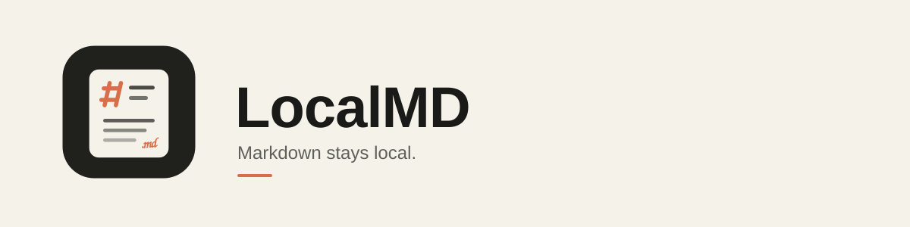

<p align="center">
  
</p>

<p align="center">
  <a href="https://github.com/lakshayxi/LocalMD/actions/workflows/ci.yml"></a>
  <a href="https://github.com/lakshayxi/LocalMD/releases/latest"></a>
  <a href="LICENSE"></a>
</p>

LocalMD reads and edits Markdown without sending your document anywhere. No
uploads, no accounts, no document backend. Use it as a website in your
browser, or as a native macOS application. Both share the same privacy
guarantee and most of the same code.

## Get LocalMD

- **Browser.** Open <https://localmd-12t.pages.dev>. No install, no download.
- **macOS (Apple Silicon).** Download the disk image from
  [GitHub Releases](https://github.com/lakshayxi/LocalMD/releases). Read
  [reports/macos/distribution.md](reports/macos/distribution.md) first — this
  is an unsigned beta, and that page covers what that means and how to open it.

| | Status |
| --- | --- |
| Browser | v0.1.0. Read, Edit, Split, save-in-place where the browser allows it, draft recovery, external-change protection. See [reports/gate-b-release.md](reports/gate-b-release.md). |
| macOS | v0.2.0 unsigned beta. Native Open, Save, Save As, and close/quit protection for unsaved work. See [reports/macos/implementation-status.md](reports/macos/implementation-status.md). |

[Tell us what's broken](https://github.com/lakshayxi/LocalMD/issues). Every
release verifies the privacy claim against the live browser deployment — see
[reports/gate-a-production.md](reports/gate-a-production.md), or run
`scripts/verify-production.mjs` yourself.

## What it does

The browser and macOS apps share this core feature set. Bullets marked
**(browser)** or **(macOS)** apply to one platform only.

- Opens Markdown by picker, drop, paste, recent file, or a new blank document.
- Renders CommonMark and GFM, heading links, tables, task lists, footnotes,
  syntax-highlighted code, KaTeX math, and Mermaid diagrams.
- Switches between Read, Edit, and Split without losing the editor state.
- **(browser)** Saves back to picker-opened files where the File System
  Access API is available; other browsers download the same bytes instead.
- **(macOS)** Saves through native Open and Save dialogs, and blocks a
  native window close or Quit with unsaved changes.
- Preserves LF or CRLF, a UTF-8 BOM, and the presence or absence of the final
  newline across edits and saves.
- Keeps bounded, local drafts and offers recovery after an interrupted session.
- **(browser)** Reloads offline and installs updates only after you accept a prompt.
- Opens documents over 2 MiB in read-only fast mode until you choose full rendering.
- Refuses to silently overwrite a file that changed on disk.

Single-dollar inline math (`$x$`) is off by default — `$5.00` and `$PATH` are
far more common in real documents than inline LaTeX. Use `$$x$$` instead.

## Privacy

> LocalMD never uploads your document. Parsing, rendering, and editing happen
> entirely on your device. There is no upload endpoint and no document backend.

Two mechanisms back this, at different strengths:

1. **`connect-src 'none'` (structural).** No `fetch`, `XHR`, `WebSocket`, or
   similar API can leave the page, even if an attacker compromises a dependency.
2. **The renderer's image gate (code).** Remote images stay blocked unless
   you explicitly allow them, per document. This is application code, not
   policy — a bug here could still produce a cross-origin request. So a test
   backs it, not just a promise: [`e2e/privacy.spec.ts`](e2e/privacy.spec.ts)
   asserts zero cross-origin requests on every browser, on every commit.

Caveats: a remote image *you* reference still contacts that host once you opt
in; the static host sees ordinary web logs (IP, user agent) but never a file;
local drafts sit unencrypted in your browser's IndexedDB. No analytics, no
error reporting, no CDN, no third-party runtime dependencies.

## Performance

On the recorded Apple M4 / 16GB sign-off machine, the latest strict run
measured:

| Document | Result | Budget |
| --- | ---: | ---: |
| 45KB real README | 104ms | <150ms |
| 250KB corpus | 438ms | <600ms |
| 1MB torture document | 1877ms, no task over 50ms | <2500ms, no task over 50ms |

Run `PERF_STRICT=1 npm run perf` for the release thresholds. Method, corpus,
and machine details: [reports/gate-b-performance.md](reports/gate-b-performance.md).

## Development

```bash
npm install
npm run dev
```

| Command | What it does |
| --- | --- |
| `npm run dev` | Dev server. Relaxed CSP — never verify privacy behavior here |
| `npm run build` | Typecheck, build, assert no third-party URLs reached `dist/` |
| `npm test` | Unit tests (Vitest) |
| `npm run e2e` | E2E across Chromium, Firefox, WebKit against a production build |
| `npm run lint` | ESLint, including module boundary enforcement |
| `npm run typecheck` | TypeScript project references |
| `npm run desktop:dev` | Start the Tauri macOS application in development mode |
| `npm run desktop:build -- --target aarch64-apple-darwin` | Build the local `.app` and `.dmg` |
| `npm run test:desktop` | Test the production desktop composition |

Publishing a GitHub Release runs the build/lint/test gate and the full E2E
matrix as a release-time record. It does not deploy — Cloudflare Pages
deploys the browser app on its own, through its Git integration, on every
push to `main`. See [.github/workflows/release.yml](.github/workflows/release.yml).

## Architecture

Single Vite app, no monorepo — but with lint-enforced module boundaries, so
`src/core` stays extractable to a package by moving the directory.

```
src/
  core/       zero DOM, zero React — the future npm package
  platform/   browser APIs (files, persistence, workers), still no React
  render/     hast -> React, block memoization, component overrides
  editor/     CodeMirror 6
  app/        shell, state, header, palette, dialogs
  desktop/    the macOS shell, native dialogs, close/quit protection
  styles/     tokens, typography, themes, print
```

ESLint enforces the import direction: `core` imports nothing internal and no
React/DOM; `platform`, `render`, and `editor` may import `core`; `app` and
`desktop` may import anything. Cross-module imports use the `@/` alias.

## Testing

- [`e2e/privacy.spec.ts`](e2e/privacy.spec.ts) — zero cross-origin requests. A release blocker at every gate.
- [`test/security/xss-payloads.ts`](test/security/xss-payloads.ts) — the sanitizer corpus, guarding against allowlist drift.
- [`scripts/assert-no-external-urls.mjs`](scripts/assert-no-external-urls.mjs) — fails the build if any third-party URL reaches `dist/`.
- [`e2e/save.spec.ts`](e2e/save.spec.ts) — proves download bytes and Save As adoption with a real Chromium OPFS handle.

More evidence: [reports/gate-b-release.md](reports/gate-b-release.md),
[reports/gate-b-manual-checklist.md](reports/gate-b-manual-checklist.md),
[reports/gate-b-performance.md](reports/gate-b-performance.md).

## License

MIT
