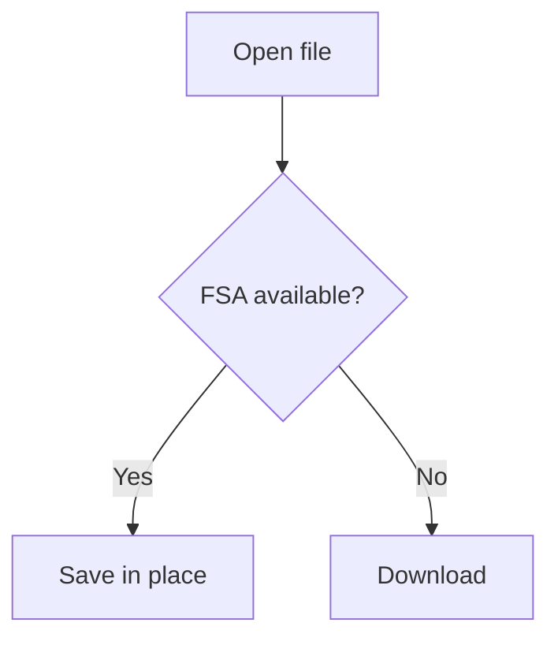
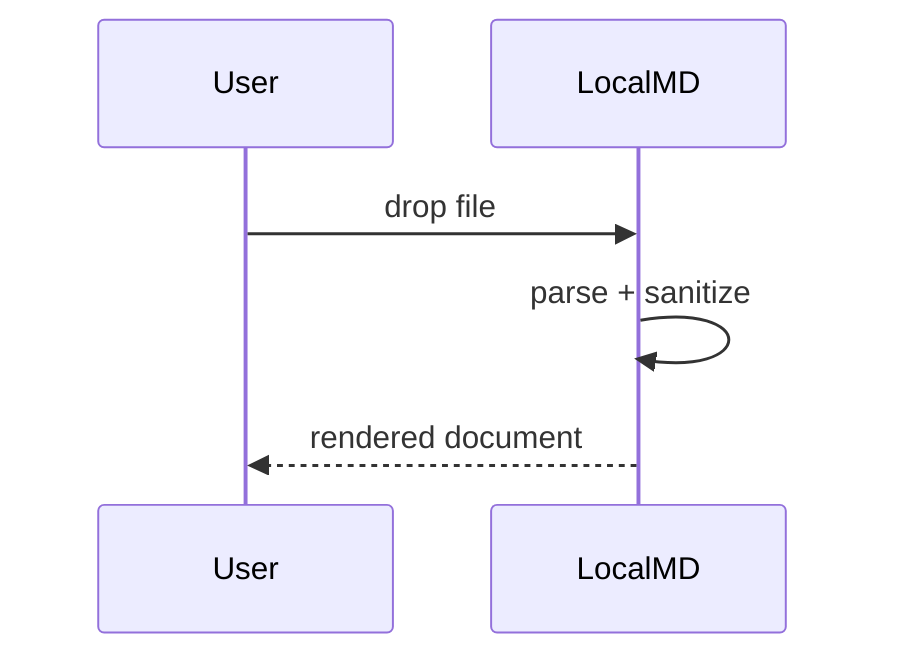

# Math and Mermaid

Both are lazy-loaded, so this fixture exists mainly to pin the parse/extract
behavior — the point where math and diagram nodes are recognized and set aside
for later rendering.

## Inline math

The complexity is $O(n \log n)$ for the sort, and $E = mc^2$ regardless.

## Block math

$$
\frac{\partial u}{\partial t} = h^2 \left( \frac{\partial^2 u}{\partial x^2} + \frac{\partial^2 u}{\partial y^2} \right)
$$

$$
\begin{aligned}
a &= b + c \\
  &= d
\end{aligned}
$$

## Malformed math (must not throw)

$$
\frac{\unknown_command{
$$

## Mermaid — valid





## Mermaid — invalid (must show an inline error, not crash the page)

```mermaid
graph TD
    A[Unclosed bracket --> B
    this is not valid mermaid
```
